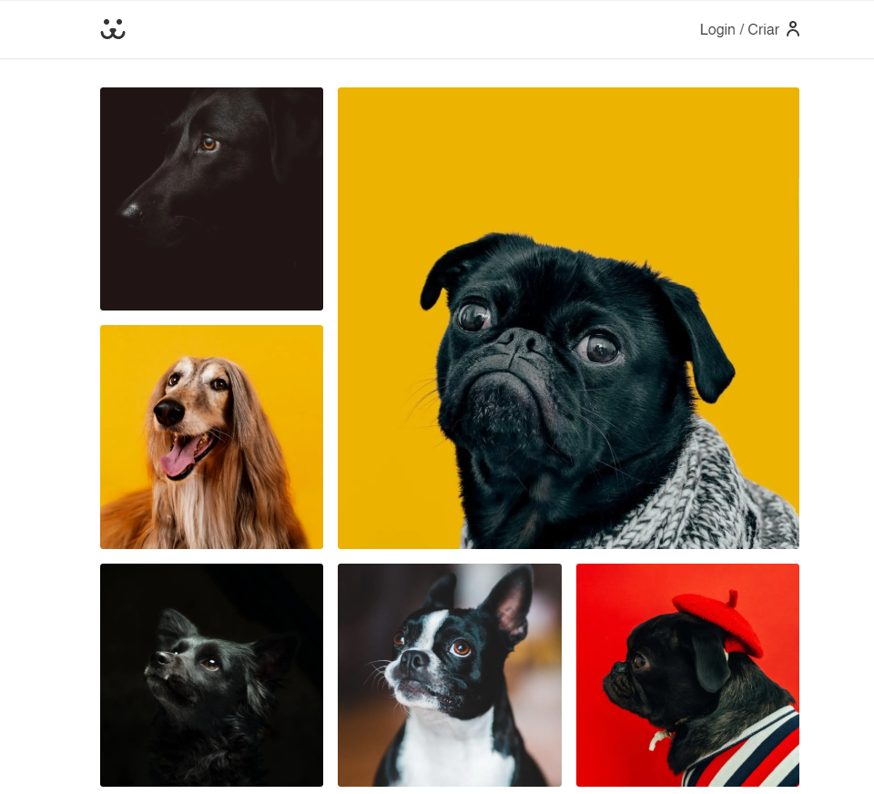

<div align="center">
  <p align="center">
     
  </p>
  Me siga nas redes sociais
  <br/>
  <a href="https://www.linkedin.com/in/paulopbi/" target="_blank" rel="noreferrer">
  Linkedin
  </a> • 
  <a href="https://github.com/paulopbi" target="_blank" rel="noreferrer">
  Github
  </a> • 
  <a href="https://www.behance.net/paulopbi" target="_blank" rel="noreferrer">
  Behance
  </a> • 
  <a href="https://dogs-next-bice.vercel.app/" target="_blank" rel="noreferrer">
  Demonstração
  </a> 
</div>
 
<br />

**Uma rede social para cachorros, onde os usuários podem compartilhar as fotos dos seus pets com outras pessoas.**

## ✨ Features

- **Autenticação do Usuário**: Segurança na criação de conta e sistema de login.
- **Upload de Fotos**: Compartilhe fotos do seu pet com a comunidade.
- **Sistema de Curtidas e Comentarios**: Interaja com outros usuários por meio de curtidas e comentários.
- **Perfil**: Visualizar suas fotos carregadas.
- **Design Responsivo**: Optimizado para todos os dispositivos, desde smartphones até desktops.

## 🛠️ Tecnologias utilizadas

- **Next.js**
- **TypeScript**
- **CSS Modules**
- **Eslint**
- **Rotas dinâmicas**
- **Middleware**
- **Server Action**
- **Context API**
- **Hooks**
- **Fetch**

## 📸 Preview



<p align="center">
  <a href="https://dogs-next-bice.vercel.app/">Você pode testar o projeto clicando aqui</a>
</p>

## 🚀 Rodando O Projeto Localmente

1. Clone o repositório

```bash
git clone https://github.com/your-username/dogs.git
```

2. Entre na pasta

```bash
cd dogs
```

3. Instale as dependências

```bash
npm install
```

4. Inicie o servidor

```bash
npm run dev
```

5. Acesse o projeto no navegador utilizando a porta [http://localhost:3000](http://localhost:3000)

<br/>

Fique a vontade para fazer um fork ou clone desse repositório clique aqui [GitHub](https://github.com/paulopbi/dogs-next).
